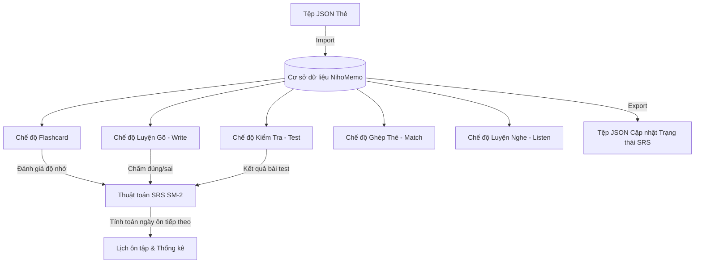

# 📚 Cấu Trúc Dữ Liệu Bộ Thẻ Học Tập NihoMemo (`data/cards`)

Thư mục này lưu trữ các tệp dữ liệu bộ thẻ học tập (Study Sets) được xuất độc lập dưới định dạng chuẩn **JSON của NihoMemo** (hiện tại bao gồm 10 bài từ vựng Minna no Nihongo N5).

---

## 📑 1. Cấu Trúc Tổng Thể Tệp JSON Export

Mỗi tệp `.json` đại diện cho một bộ thẻ hoàn chỉnh, có cấu trúc phân cấp gồm 2 tầng: **Metadata Bộ thẻ** và **Danh sách thẻ học (`cards`)**:

```json
{
  "app": "NihoMemo",
  "version": "1.0.0",
  "exportedAt": "2026-10-09T17:31:54.017Z",
  "studySet": {
    "id": "cmv179eju00005wax4n47llyx",
    "name": "Thẻ ghi nhớ: Bài 1 minna | Quizlet",
    "description": null,
    "sourceLanguage": "ja",
    "targetLanguage": "vi",
    "folderName": "Minna no Nihongo N5 (Bài 1 - 25)",
    "cardCount": 45,
    "cards": [ /* Danh sách các thẻ chi tiết */ ]
  }
}
```

### Các trường cấp bộ thẻ (`studySet`)

| Trường | Ý nghĩa đối với Người học | Ý nghĩa đối với Máy / Hệ thống |
| :--- | :--- | :--- |
| `app` & `version` | Biết phiên bản dữ liệu tương thích. | Kiểm tra tính tương thích khi Import (tránh sai lệch schema giữa các phiên bản). |
| `exportedAt` | Thời điểm tệp được sao lưu. | Xác định phiên bản mới nhất khi đồng bộ hoặc khôi phục dữ liệu. |
| `id` | Mã định danh gốc của bộ thẻ. | Dùng để cập nhật đúng bộ thẻ khi ghi đè, hoặc sinh mã mới nếu tạo bản sao. |
| `name` | Tên bộ thẻ hiển thị trên giao diện học tập. | Khóa tìm kiếm, tiêu đề hiển thị và tên tệp khi xuất file. |
| `sourceLanguage` | Ngôn ngữ nguồn (mặc định: `ja` - Tiếng Nhật). | Cấu hình bộ đọc Text-to-Speech (TTS), nhận diện giọng nói và bàn phím ảo. |
| `targetLanguage` | Ngôn ngữ đích giải nghĩa (mặc định: `vi` - Tiếng Việt). | Xác định ngôn ngữ hiển thị nghĩa và câu hỏi dịch thuật. |
| `folderName` | Tên thư mục cha chứa bộ thẻ (nếu có). | Tự động tạo hoặc gán bộ thẻ vào đúng thư mục khi người dùng Import tệp này. |
| `cardCount` | Tổng số lượng thẻ trong bộ. | Hiển thị badge số lượng thẻ, kiểm tra tính toàn vẹn (integrity check) sau khi import. |

---

## 🔍 2. Giải Thích Chi Tiết Từng Trường Của Thẻ (`Card`)

Mỗi phần tử trong mảng `cards` là một thẻ học tập độc lập. Dưới đây là phân tích chi tiết theo 2 góc nhìn: **Con người (Người học)** và **Máy (Hệ thống & Thuật toán NihoMemo)**:

### 2.1. Nhóm Dữ Liệu Cốt Lõi (Nội dung bài học)

```json
{
  "term": "～くん ～君",
  "reading": "～くん ～君",
  "definition": "bé (dùng cho nam) hoặc gọi thân mật."
}
```

* **`term` (Từ vựng / Thuật ngữ chính):**
  * 👤 **Người học:** Là **mặt trước** của Flashcard, từ tiếng Nhật (Kanji hoặc Kana) cần nhận biết và ghi nhớ.
  * 🤖 **Máy:** Làm khóa so sánh (`target string`), hiển thị trên các ô ghép từ trong chế độ *Match*, hoặc làm câu hỏi trong các bài tập nhận diện mặt chữ.
* **`reading` (Cách đọc / Furigana):**
  * 👤 **Người học:** Hướng dẫn phát âm chuẩn xác khi `term` chứa chữ Hán (Kanji).
  * 🤖 **Máy:** Dùng làm văn bản nguồn cho bộ phát âm **Text-to-Speech (TTS)**; làm đáp án chuẩn để đối chiếu khi người học gõ Furigana/Romaji trong chế độ *Write* hoặc kiểm tra nghe trong chế độ *Listen*.
* **`definition` (Ý nghĩa tiếng Việt):**
  * 👤 **Người học:** Là **mặt sau** của thẻ, diễn giải ý nghĩa và ngữ cảnh sử dụng của từ vựng.
  * 🤖 **Máy:** Hiển thị khi lật thẻ; làm câu hỏi gợi ý khi luyện gõ (*Write*); làm mồi nhử (*Distractors*) ngẫu nhiên trong bài trắc nghiệm (*Test*).

---

### 2.2. Nhóm Bổ Trợ Ngữ Cảnh & Đa Phương Tiện

```json
{
  "example": null,
  "exampleTranslation": null,
  "imageUrl": null,
  "audioUrl": null,
  "note": null
}
```

* **`example` & `exampleTranslation`:**
  * 👤 **Người học:** Câu ví dụ thực tế và bản dịch giúp người học hiểu ngữ cảnh câu và ngữ pháp đi kèm.
  * 🤖 **Máy:** Render khối ví dụ trực quan dưới từ vựng. Nếu là `null`, máy tự động ẩn để giữ giao diện tối giản, tập trung.
* **`imageUrl`:**
  * 👤 **Người học:** Hình ảnh minh họa trực quan kích thích trí nhớ hình ảnh (Visual Memory).
  * 🤖 **Máy:** Tải và hiển thị ảnh, tối ưu cache CDN để tải thẻ siêu tốc.
* **`audioUrl`:**
  * 👤 **Người học:** File ghi âm giọng người bản xứ thực tế.
  * 🤖 **Máy:** Nếu có URL âm thanh thì ưu tiên phát; nếu `null`, máy tự động chuyển sang cơ chế **Fallback TTS của trình duyệt** (`SpeechSynthesisUtterance` với `lang: ja-JP`), đảm bảo người học luôn nghe được phát âm.
* **`note`:**
  * 👤 **Người học:** Ghi chú cá nhân, mẹo ghi nhớ mẹo (Mnemonic), hoặc các lưu ý đặc biệt.
  * 🤖 **Máy:** Hiển thị dưới dạng tooltip hoặc nhãn phụ khi người học cần trợ giúp.

---

### 2.3. Nhóm Phân Loại Ngôn Ngữ & Hán Tự Chuyên Biệt

```json
{
  "jlptLevel": null,
  "wordType": null,
  "radicals": null,
  "strokeCount": null,
  "onReading": null,
  "kunReading": null,
  "compounds": null
}
```

* **`jlptLevel` (`N5` ➔ `N1`):**
  * 👤 **Người học:** Nhận biết độ khó và lộ trình thi chứng chỉ.
  * 🤖 **Máy:** Lọc danh sách thẻ theo cấp độ, thống kê tỷ lệ từ vựng đã nắm vững theo từng bậc JLPT trên trang Thống kê (*Stats*).
* **`wordType` (Danh từ, Động từ nhóm 1/2/3, Tính từ -i, -na...):**
  * 👤 **Người học:** Biết cấu trúc ngữ pháp để chia thì và kết hợp câu.
  * 🤖 **Máy:** Hỗ trợ thuật toán chia thể tự động (thể Te, thể Ta, thể Phủ định...).
* **`radicals`, `strokeCount`, `onReading`, `kunReading`, `compounds`:**
  * 👤 **Người học:** Dành riêng cho học chữ Hán (Kanji): hiển thị bộ thủ cấu tạo, số nét viết tay, âm On (Hán-Nhật), âm Kun (Nhật thuần) và các từ ghép thường gặp.
  * 🤖 **Máy:** Kích hoạt component bảng tra cứu Hán tự, lưới vẽ nét bút chữ Hán và liên kết các từ vựng có chung bộ thủ.

---

### 2.4. Nhóm Điều Phối Thuật Toán & Quản Lý Lộ Trình

```json
{
  "order": 0,
  "tags": ["N5", "Bài1", "Quizlet"],
  "srsStatus": "New"
}
```

* **`order` (Thứ tự hiển thị):**
  * 👤 **Người học:** Đảm bảo học các từ theo đúng trình tự giáo trình (ví dụ: từ số 1 đến 45 của Bài 1).
  * 🤖 **Máy:** Dùng làm khóa sắp xếp `ORDER BY "order" ASC` khi truy vấn CSDL, giữ nguyên tính nhất quán của danh sách bài học (trừ khi bật chế độ *Shuffle*).
* **`tags` (Hệ thống nhãn đa chiều):**
  * 👤 **Người học:** Phân nhóm linh hoạt theo bài học (`Bài1`), cấp độ (`N5`), hoặc nguồn dữ liệu (`Quizlet`).
  * 🤖 **Máy:** Liên kết với bảng trung gian `CardTag`, hỗ trợ tìm kiếm đa tiêu chí và tạo các bộ học tùy biến theo nhãn (Custom Study Sets).
* **`srsStatus` (`New` | `Learning` | `Review` | `Mastered`):**
  * 👤 **Người học:** Nắm được mức độ thuộc bài hiện tại của từng thẻ.
  * 🤖 **Máy (Trái tim của thuật toán Lặp lại ngắt quãng SM-2):**
    * `New`: Thẻ mới, ưu tiên nạp vào danh sách học hôm nay.
    * `Learning`: Đang trong chu kỳ học ngắn (trong ngày).
    * `Review`: Đã nhớ ngắn hạn, đưa vào lịch ngắt quãng (sau 1 ngày, 3 ngày, 7 ngày...).
    * `Mastered`: Đã thành thạo, giãn khoảng cách ôn tập dài (vài chục ngày).

---

## 🔄 3. Vòng Đời Dữ Liệu Trong Các Chế Độ Học



---

## 🛠️ 4. Cách Sử Dụng Tệp Dữ Liệu

1. **Khôi phục / Nhập vào hệ thống:**
   - Mở giao diện NihoMemo ➔ Truy cập trang **Nhập & Xuất Dữ Liệu** (`/import-export`).
   - Chọn tab **JSON**, kéo thả bất kỳ tệp nào trong thư mục này để tạo mới hoặc phục hồi lại bộ thẻ.
2. **Chỉnh sửa dữ liệu hàng loạt:**
   - Bạn có thể chỉnh sửa trực tiếp các trường `definition`, `example`, hoặc bổ sung `jlptLevel` trong tệp JSON trước khi nhập vào hệ thống để làm giàu nội dung bài học.
